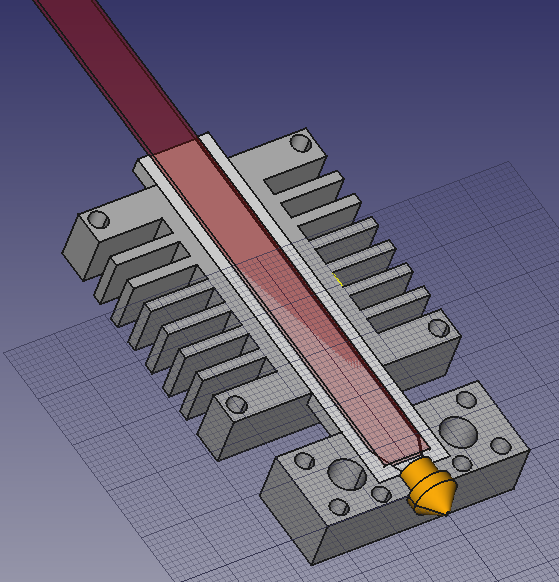
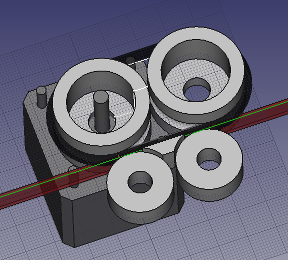
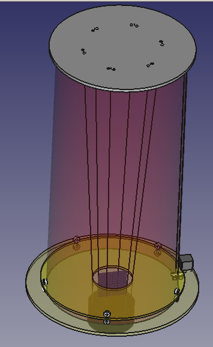

# Open source automation

Accessible general-purpose digital fabrication tools,
in combination with open source designs, hardware and software,
makes it feasible to also create small-scale (and local) special-purpose
automation.

In a world where globalized large-scale specialized production is the norm,
specialization may be needed in order to compete on cost/time per unit.

## Challenges

Large scale production needed to justify investment
* Lower costs drastically
* Reduced longevity compared to commercial scale
* Reduced production speed compared to commercial scale
* Share facilities. Like a makerspace, or in a makerspace.

Often need just a few bits produced
* Sell surplus in shared facilities
* Focus on things that *are* generally needed.
Life consumables. Food,water,clothing,soap.
Materials. Plastic,wood,metals

Specialized skills / training needed for operations.
* Very high degree of automation.
* Rich user interfaces
* Shared facilities as scaleable learning
* Online community, world-scale

## Reconfigurability

Instead of building entirely purpose-built systems, it makes sense to see a particular system
as a particular configuration of re-usable modules.

[Reconfigurable Manufacturing System](https://en.wikipedia.org/wiki/Reconfigurable_Manufacturing_System)
"The components of RMS are:
CNC machines, Reconfigurable Machine Tools, Reconfigurable Inspection Machines and material transport systems".

"Ideal Reconfigurable Manufacturing Systems possess six core characteristics:
Modularity, Integrability, Customized flexibility, Scalability, Convertibility, and Diagnosability"

## Submodules

* 3-axis CNC-machining. Router/mill. Vertical,horizontal
* 3d-printing. Plastics. Reprap project.
* Robotic arm.

## Module coordination

* Conveyers. Belts,rollers,wheels,shaking
* Selecting and diverting. Quality,re-processing,sampling
* Part registration

## Cases

## Filament for 3d-printer

Automate recycling of PET bottles?
The typical process is to shred to pieces, then extrude into filament.
But what if we can slice the bottle(s) into a long strip, and then feed this directy to 3d-printer?

There exist many DIY (manual) tools for making this easy, usually based on standard utility knife blades.
After cutting off the base of the bottle, and making a small cut for entering, feed the bottle into knife slot.
Then pull evenly at the strip until the end of the bottle is reached.

* [Instructables: PET string cutter](http://www.instructables.com/id/PET-string-cutter-string-from-plastic-bottle/step3/step3/). Table-based design, very simple.
* [Youtube: How to Make Rope from Plastic Bottles](https://youtu.be/yLt-ebcNUnE?t=40). Video using/making the above table-based design.
* [Thingiverse: Plastic-Bottle-Cutter](http://www.thingiverse.com/thing:1390011). Concept model with video. Hand-held. Slots for different sizes.
* [Thingiverse: plastic bottle cutter](http://www.thingiverse.com/thing:1997447). Small box, can be affixed to table with clamp. FreeCAD source
* [Thingiverse: Plastic Bottle Cutter](http://www.thingiverse.com/thing:1940067). Handheld, with adjustable width. 1 make.
* [Thingiverse: Cube bottle string maker](http://www.thingiverse.com/thing:2020409). Small handheld box. Nice demonstration video.
* [UTSUMI: Artesanato com garrafas PET](http://www.utsumi.com.br/pet/filetador/index.html). One handheld design, and one really nice "industrial".
Bottle supported by a circular, and with guides on outer side.

It seems the PET moving through is abrasive, so some metal parts are needed to protect vunerable areas if 3d-printed.
Must ensure that there is something forcing, so strips don't get thinner than desired. For instance by a slight press on top of bottle
Would heating up the blade be of any benefit? 

How much plastic is in one plastic bottle? A 0.5 liter bottle is around 10 grams.
In Norway, each bottle can be recycled for 1 krone, giving a 100 kr/kg. price. 3d-printer filament is around 250 kr/kg.

May requires custom extruder, and possibly custom hotend.

An advantage of the flat strip filament compared to standard circular is increased/simpler gripping surface for the extruder.
Because the width of the strip can be controlled well, if one can measure the thickness one can have volumetric control.
Can extruder be made with less vitamins / special parts with such strips?
Can the hotend be more efficient, due to higher ratio of surface area to volume?

A challenge is that filament is usually continious, and 1 bottle will not print a whole part.
Either one can try to join the filament, probably by fusing it.
Or possibly one could design an extruder which can feed multiple independent strands of filament coming after eachother?
For instance by having multiple wheels after eachother, such that losing grip in the 'handover' is not an issue. 

The "puller" is basically an 3d-printer extruder.
How wide do strips need to be to be same volume as standard circular filament?
Wall thickness seems to be between 0.5mm to 1.5mm, with average of 0.75mm
[1](http://www.justanswer.com/general/7qbsc-thick-wall-squeezable-pet-bottle-millimetres.html).

* 1.75 mm, A=9.62 mm2, C=11mm. ~9mm wide strip, C=~20 mm (2x)
* 2.85 mm, A=25.52 mm2 C=18mm. ~25mm wide strip, C=~52 mm (3x)

Assuming a 0.5 liter bottle. With average radius=60mm, and 160 mm usable height.
Lateral surface area of 60318 mm2. Around 6000mm = 6 meters of 9mm strip.

Assuming 200 mm/second pulling speed, around 30 seconds per bottle.
With 10 seconds switchover between bottles, can make 1 kg filament of 100 bottles in around 1 hour.
((30+10)*100)/(60*60).

The filamen is also useful to use as a material with other processes.
It can be woven.
Can it be braided?
Perhaps it can be woven/cross-laminated, and then heat-pressed into sheets?
Then again, could just cut along middle and flatten it directly!
Can the flexibility of a woven cloth be used to shape, then affix the shape using heat?
It usually has mild heat-shrinking capability.
Can the filament be used instead of wire 

### Hotend for flat filament

 |
[FreeCAD source](./flatfilament-hotend.fcstd)

Designed to be machined on a 3-axis CNC-mill, from top side only, using 3mm+ endmill.
Two mirrored sides which are then sandwhiched together using screws.
The central liner is slightly thicker (0.6mm) than its pockets, so that it mates first when tightening the screws.
This will hopefully avoid plastic seeping out along the seamline...
A side-effect of the sandwitched design is that the entire thing can be opened up, for instance to do maintenance after a clog.

* Hotend and cold-end (heatsink) in 10mm aluminium.
* Inner liner in PTFE or steel (3mm).
* Using standard 6mm OD heater cartridge, thermocouple and M6 nozzle.
* Mounting holes for 40 mm fan. Also acts as mount onto machine.

This design could likely be adapted for a standard circular 1.75mm filament.
Would use a 4mm OD, 2mm ID tube as the liner, and a 4mm ballnose to make the pocket.
This could either be PTFE or stainless steel.
A supporting disc between hotend and heatsink would likely be needed for strength.

As the tolerances needed are relatively loose, it is possible that the aluminum pieces could be cast without CNC-finishing.

### Extruder for flat filament

| [FreeCAD source](./flatfilament-extruder.fcstd)

* Using a rubber O-ring as drive, against metal bearing idlers
* Bearings are standard 608

The O-ring would be tensioned hard enough to compress slightly, hopefully ensuring sufficient friction for reliable drive.

For abrasion protection, likely some surfaces would be covered by thin aluminum (from beverage can or similar).

## Converting flat sheets

For creating flat filament out of a standard 1mm plastic sheet.

| [FreeCAD source](./flatfilament-sheetstripper.fcstd)

Space for a sheet around 2000x1000. At 1mm, this is approx 2000cm3 or 2 kg of plastic.
PETG, ABS, HIPS, HDPE, PolyPropylene and PolyCarbonate are all easily and cheapely available in such sizes. 

This sheet-cutting machine would be slaved to the extruder motion.
For instance by an optical tracker which detects and controls motion such that there is no gap between the
filament piece being pulled by the extruder, and the piece currently being produced.
Can possibly be done with just a slotted optical sensor, and binary logic:
When light shines through, run the machine. While no light, don't run.

A challenge is retracts. A buffer-zone which allows filament strip to bend up along a longer path than straight ahead.

Another is challenge transportation between strip-maker and extruder.
Because of the discontinuities some Bowden-like support is needed along the path, however a circular cable does not fit.
Possibly a closed U-profile made from a sandwich of several layers of similar thin sheets can be used.
If the layers can move with respect to eachother, flexibility should be OK.
Reducing the surface area by making them perforated may reduce friction. 

## Plastic/composite sheets

See [fabricatable-machines/sheet-maker](https://github.com/fellesverkstedet/fabricatable-machines/tree/master/sheet-maker)

## Related work

* [3d-printed power hacksaw](https://3dprint.com/126525/3d-printed-power-hacksaw/).
[version 4](http://www.thingiverse.com/thing:1555072)
* [Ribbon Microphone Corrugator](http://www.thingiverse.com/thing:1558683), 3d-printed

* 3d-printed mini-lathe, [demo video](https://www.youtube.com/watch?v=k-f7Dvw6EnA),
several alternatives on Thingiverse. Could be automated with couple of steppers.
Tool change and registration are challenges for full automation.

* [Automated candy maker](http://www.thingiverse.com/thing:1786518).
For Halloween. Lasercut and 3d-printed
