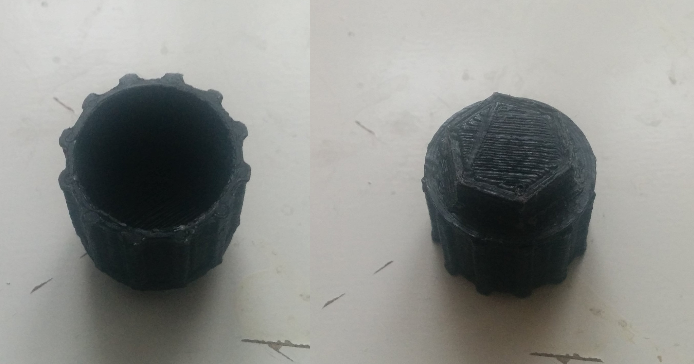
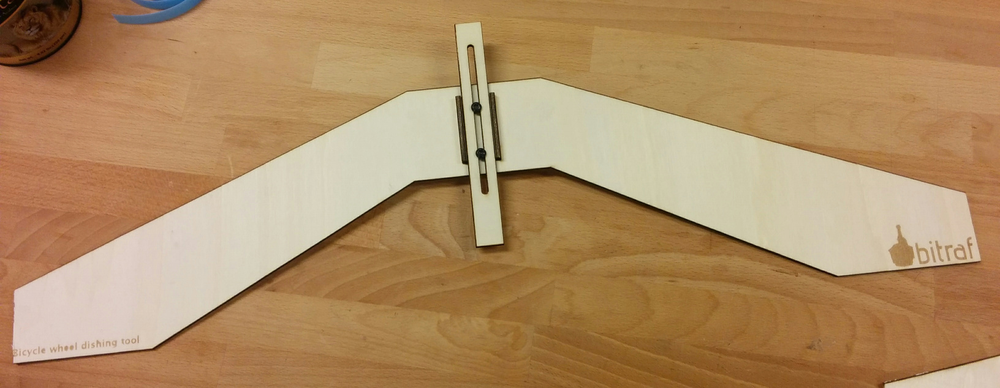

Projects around or involving bikes/bicycles.

I worked for 6 years a bike salesman and mechanic at
Din Sykkel / [Sykkellåven](http://www.sykkellaven.no/) in Tønsberg while studying.

## License

All files in this folder are available under the [CC-BY 4.0](http://creativecommons.org/licenses/by/4.0/) license.

    You are free to:

        Share —
          copy and redistribute the material in any medium or format
        Adapt —
          remix, transform, and build upon the material for any purpose, even commercially.

    Under the following terms:

        Attribution —
          You must give appropriate credit, provide a link to the license, and indicate if changes were made.
          You may do so in any reasonable manner, but not in any way that suggests the licensor endorses you or your use.

        No additional restrictions —
          You may not apply legal terms or technological measures that legally restrict others from doing anything the license permits.

Please attribute to `Jon Nordby`, with a link to `https://github.com/jonnor/projects/tree/master/bicycle`.

Tools
=====

Casette removal tool
---------------------

For Shimano, CS-HS80-9 and similar.

Meant for use with a 15mm (pedal) wrench.

For removing a cassette you will need a chain-whip,
or some other means of preventing the casette from turning.
In the mounting direction, the casette stops naturally.

Printed and tested for fit. Have not used it yet.

# Wheel dishing tool

For centering the hub relative to the rim when building wheels.

[FreeCAD source](./wheel-dishing-tool.fcstd) |
[DXF for laser](./wheel-dishing-tool.dxf)

# In progress

## Rear derailleur

Status: *Prototyping*. Parallelogram motion and chain tensioner principle tested OK.

Ideas

* Use heads of standard m3 screws as the glide parts of paralleogram pivots
* Be compatible with existing (Shimano) systems, dropout attachment

TODO: 

* Buy/design+fit idler wheels
* Add a fastener for attaching to frame (M10 towards dropout?)
* First functional test, w/ friction shifter
* Make parallelogram a bit longer to preload spring better
* Make wire pull distance compatible with Shimano
* Verify/fix angle for following sprockets
* Add adjustable stopper screws

Vitamins needed

* Stretch spring. Source: Clas Ohlson
* Torque spring. Source, Clas Ohlson
* 4x M3-16 screws
* 1x M6-50 bolt

## Remote for dampener lock-out

For RockShox SID.

Status: *Prototyping*. Lower part fits OK, works as replacement for manual operation. Top parts needs designing.

Ideas

* Remote to be usable with different dampeners by switching lower part (that goes onto dampener),
including rear suspensions

TODO

* Design upper part. Two-way friction lever, or spring on one side?
* May need to modify lower part, so that wire is supported when being pushed
* Decide if wire ball goes on bottom or upper end
* Test!

Vitamins needed

* Bicycle gear wire and Bowden tube. ~1 meter

Ideas
=====

Electricity generator
-----------------------

To keep in shape while being on the computer, and make the electricity useful instead of just going to waste.

Coupling:

Store-bought generators/loads are often coupled onto the tyre.
This wears a lot on the tyre, is not suitable for mountain-bike type tyres.
Instead we propose a replacement "wheel", where the generator is coupled 
onto the hub/casette or using a replacement hub.
Depending on motor/generator, gearing might be neccesary.

Motor:

Motor can be a 12/24V alternator from car/MC, sourced or recycled locally.
[Biltema](http://www.biltema.no/no/Bil---MC/Bilreservedeler/Elektrisk-anlegg/Dynamo/)
Alternative is to use brushless motor from RC/multicopter,
potentially requiring more complex charge control. HobbyKing etc.
Or ultimately, to be able to 3d-print the motor itself.

Many of the thing learned here could be useful for similar systems,
off-grid solutions like human powered water pumps etc.
Or to make an electric bicycle, or dual-purpose system,
which can both for excercise/generation and for transportation/motor.

TODO:

* Design initial concept models

3d-printed tools
-------------------

Exists Thingiverse

* Pedal wrench 15mm [1](http://www.thingiverse.com/thing:90605)
* Pads for keeping hydraulic brakes safe when disc is out. [1](http://www.thingiverse.com/thing:471166)
* Crank bolt tool [1](http://www.thingiverse.com/thing:92353)
* Ratchet/thumb-screw 1/4" bits (for 8,9,10mm bolts) [1](http://www.thingiverse.com/thing:207389)
* [Dummy hub for maintenance/transport](http://www.thingiverse.com/thing:985382)

TODO

* thumb-screw for 1/4" bits 
* triangle for 4,5,6mm allen key (using standard bits?)
* pump, using one-way / check-valves and Ninjaflex gasket

3d-printed parts
------------------

With the eventual goal of being able to print, everything needed for a practical bike.
On a standard 20x20x20cm RepRap-style printer, not specialized machine.
Bigger structural elements like the frame, is considered a separate project, see below.

Some things are quite safety critical, like brake, propulsion and steering system.

In progress:

* Grip Shift indexed shifter
* V-braket

Thingiverse searches:

* [Shimano](http://www.thingiverse.com/search/page:1?q=shimano&sa=)
* [Avid](http://www.thingiverse.com/search/page:1?q=avid&sa=)
* [Rockshox](http://www.thingiverse.com/search?q=rockshox&sa=)
* [SRAM](http://www.thingiverse.com/search?q=sram&sa=)
* [Bike](http://www.thingiverse.com/search?q=bike&sa=)
* [Bicycle](http://www.thingiverse.com/search?q=bicycle&sa=)

TODO:

* Replacement covers for Shimano shifters
* Indexed Shimano/STI shifter.
* Drop-out. Hugely beneficial to 3d-print, due to hundreds of variations
* Casette offset ring, for fitting 6-7gear casette on 8/9/10 hub
* Remotes for suspension-forks
* Hub, using standard ball bearings. 608Z with M8 threaded rod axel?
* Freehub/wheel, using some ratchet mechanism. Inspiration: [1](http://www.thingiverse.com/thing:28805)
* Belt-based power transmission

Work by other people:

* [Brake handle](http://www.thingiverse.com/thing:243633)
* Friction gear shifter [Thingiverse](http://www.thingiverse.com/thing:112602) [video](https://www.youtube.com/watch?v=fLMA-8aSsDM)
* [Barrel adjuster](http://www.thingiverse.com/thing:87391)
* [Handlebar grip](http://www.thingiverse.com/thing:825566)
* [Deraillur guide wheel](http://www.thingiverse.com/thing:46393)
* [Rockshox topcap replacement](http://www.thingiverse.com/thing:216280)
* [Avid break bar clamp](http://www.thingiverse.com/thing:375601)
* [Avid Elexir brake lever](http://www.thingiverse.com/thing:278216)
* [Brake cable tensioner](http://www.thingiverse.com/thing:1023143)

Accessories:

* [Mudguard](http://www.thingiverse.com/thing:355386)
* Chain protection rings
* LED read light mount [1](http://www.thingiverse.com/thing:226475)
* Bottle mount [1](https://www.youmagine.com/designs/bike-bottle-mount)

Non-open 3d-printable work

* [Bar-ends](http://www.shapeways.com/product/25ZVUMHBJ/handlebar-bicycle-accessories?li=search-results-6&optionId=42109292)
* [Chainring for GT2 belt](http://www.shapeways.com/product/9X6E35ZMN/strida-belt-wheel-for-5-bolt-130-mm-spider?li=search-results-12&optionId=11994392)

Research:

* Shimano patent on sprokets [US patent no 4889521](http://www.google.com/patents/US4889521) expired in 2008.
* Bike [chains](http://en.wikipedia.org/wiki/Bicycle_chain#Sizes)/[sprokets](http://www.gizmology.net/sprockets.htm)
are #40 of ISO, 12.7mm pitch, 7.65mm roller diam, roller width 1/8" or 3/32", extern thickness depending on N-speed
* [Rear deraillurs](http://en.wikipedia.org/wiki/Derailleur_gears#Rear_derailleurs)
* Radius of sproked with N teeth of given pitch: r=(N*pitch)/(2*pi)
* [Indexed shifting reference](http://en.wikibooks.org/wiki/Bicycles/Maintenance_and_Repair/Gear-changing_Dimensions)
2.8mm pull for 7-8 gears rear.
* Rachet+prawl, mechanism to convert rotation->linear action:
[Thingiverse](http://www.thingiverse.com/search?q=Ratchet&sa=)
[Wikipedia](http://en.wikipedia.org/wiki/Ratchet_(device))
* [Belt-driven bicycle](http://en.wikipedia.org/wiki/Belt-driven_bicycle)
* Looks like a drop-out is 9-25 USD to 3d-print in plastic (Shapeways, Ponoko, Sculpteo)
* [Shimano grip shifter patent](http://www.google.com/patents/US6718844)

Continous variable transmission

* References [wiki](https://en.wikipedia.org/wiki/Continuously_variable_transmission)
* To be used in combination with belt-drive.
* Principle: 2 variable-diameter pulleys, connected by belt. To shift, make one pulley bigger, other smaller.
* Commonly used in scooters. Then with automatic regulation of gearing, using springs influenced by rotation speed.
* + Forces distributed over relatively large areas. Should be reproducible without speciality parts.
* Some [sketch models](./transmission-pulley-cvt.fcstd) of testing jig
* Existing models [cone-based CVT](http://www.thingiverse.com/thing:531481)
* Challenge: making compact enough?

3d-printed bicycle structure
----------------

Bigger structural elements are particularly challenging to 3d-print on a
standard ~20x20x20cm RepRap-style printer.
Both due to the sizes of the objects, and requirements for structural integrity.

Several commercial plastic-based (usually injection molded) bikes have been attempted,
[most failed](http://en.wikipedia.org/wiki/Plastic_bicycle).

Existing work:

* [ColorFabb: 3d-printed bike (using alu tubing)](http://www.thingiverse.com/thing:892442)
* Aenimal BHULCK by Eurocompositi: Fully PLA-printed frame.
[news](http://www.3ders.org/articles/20150901-eurocompositis-3d-printed-pla-bike-frame--made-from-plants--wins-eurobike-gold-award.html)
[website](http://www.aenimal.it/)

Ideas:

* Use glass/carbon/bio fiber+resin reinforcement on 3d-printed shell. Existing research:
[1](http://www.thingiverse.com/thing:91464)
* Use Vacuum-bag-forming of fiber for production speed?

Parts:

* Frame
* Wheels
* Fork for frontwheel
* Seatpost
* Handlebars and stem
* Crank-arms

Crank-arms:

A conceptual sketch of a 175mm crank-arm (25 mm tall), using the simplest possible geometry,
estimated to 2-3 hours print time on an Ultimaker.
In addition to the strength of the arm itself,
the connections to both the bottom bracket and the pedals are challenging.
On the bottom bracket side, a system like ISIS with higher surface area might
be preferrable over the typical 4-sided press-fit.

Pedal connections could be enforced with a steel insert with threads,
as found on commercial composite crankarms. 
Preferably one could thread directly in printed part.
Using custom pedals, one could put the bearings into the crank arm instead of pedal,
allowing to avoid threads in the arm.

Due to problems with poor layer bonding, making Hollowtech style cranks seems very hard.

Frame:

A medium (54cps) frame standard hybrid frame is approx 2.7 meters of tubing, front-fork excluded.
2800mm/200mm = 14 pieces.
Assuming a 60 mm outer diameter for all tubes, with single wall takes approx 1.5 hour per piece,
for a total of 14*1.5 = 21 hours printing time, or ~6 hours on 4 printers.

Here is couple of videos of failed headtube design
[1](https://www.youtube.com/watch?v=4stXilZLl7o),
[2](https://www.youtube.com/watch?v=OgAwC1GCYJQ)

Wheels:

A standard 26" inch wheel (559mm) would require approx 9 pieces.
Can be done with just one joint between center piece and the rim.
A 622mm wheel would probably require 16, and require multiple joints, and thus much less suitable.
With semi-slim tyres ~1.75"/47mm, the rim width for a clincher profile should be 19-25mm.

* http://en.wikipedia.org/wiki/ISO_5775
* [Clincer rim profile](http://en.wikipedia.org/wiki/Bicycle_tire#/media/File:Sezione_cerchione_bicicletta.svg)
* [Carbon MTB wheel profile, DT Swiss](http://en.wikipedia.org/wiki/File:Carbon_composite_MTB_wheel.JPG)

