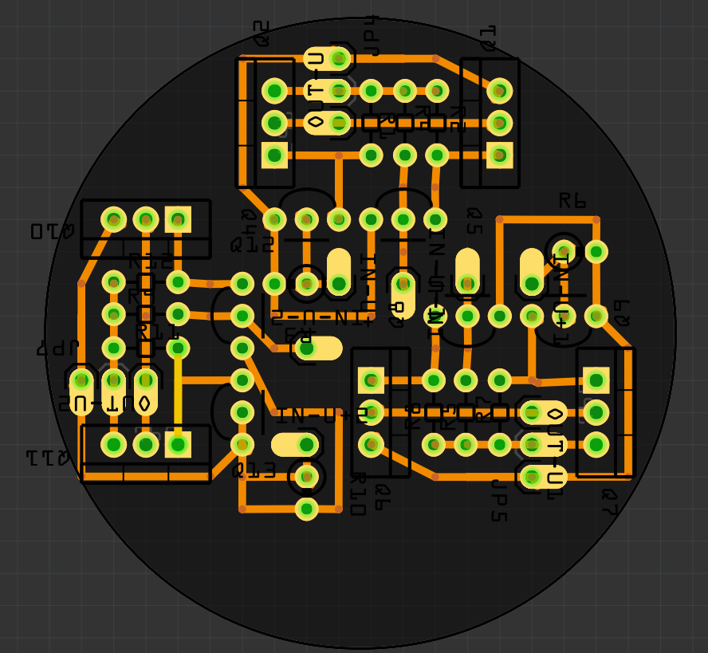
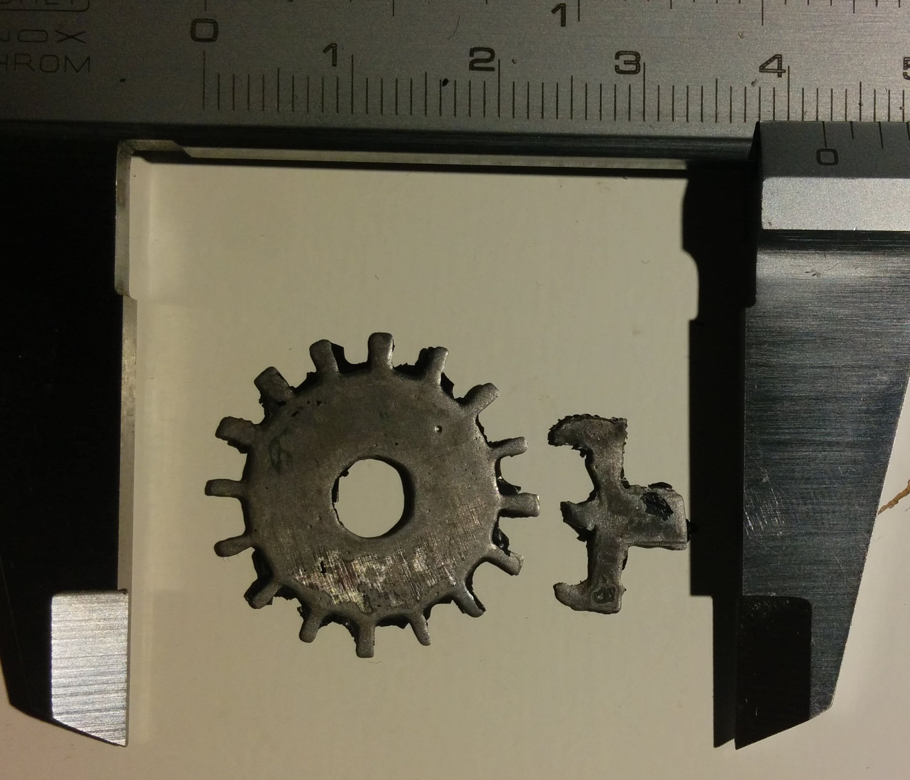

# 3d-printable brushless DC motor

Inspired by [3d-printed DC motor by pitrack]
(http://www.instructables.com/id/3D-Printed-DC-Motor/step4/Mechanical-Design/)

Overall this design is less printable (more vitamins),
but is hopefully practical and powerful enough to be useful in realistic scenarios.

## Notable changes

* Integrated driver electronics. Standard components, designed for reuse.
* Outrunner design instead of inrunner
* Using iron-core (M4 bolts) electromagnets instead of air
* Has a bearing (608) and a metal axel (M8)
* 6 pole stator, 8-10 pole rotor instead of 3/4
* Smaller distance between rotor and stator magnets

Important features retained

* 3d-printable w/common vitamins
* Winding of electromagnets done separately, facilicated by winding tool

Drawbacks

* More vitamins required
* Magnets have to be glued to rotor

## Usecases

* PC/cooling fan. Radial or axial. 80/120 mm.
* Peristaltic pump (fluids). Might need gearing
* Camera jig, using belt/wires to translate to linear motion
* Electromagnet winding tool, so it can help replicate itself!
* Extruder/print cooling fan. Requires minimization

## TODO

* Complete uC and Hall-sensor part of electronics
* Calculate appropriate number of windings
* Manufacture, assemble and test prototype

## References

* [Good video explanation](https://www.youtube.com/watch?feature=player_detailpage&v=C1-klL3B9LU#t=734)

# Fabricated stepper motor

* Should be able to mill 0.5mm silicone iron on Shopbot
* Using 2mm bit, tooth spacing of ~3mm
* 200/6 = 33 steps = 10.8 deg -> diameter = 32 mm
* 200/4 = 50 steps = 7.2 deg -> diameter = 48 mm

[FreeCAD project file](./stepper-motor.fcstd)

## Etching steel

Tin-can materials are magnetic (3/3 tested). A thickness of 0.3 mm (approx 0.012") seems to be common.
The material is some form of steel.

Steel can be etched using a acid and electrical current.
Here is one [etching steel with vinegar, salt and 12v battery charged](https://www.youtube.com/watch?v=zhWNmNYT-Q4).
Another electro etch [using a metallic electrolyte](http://www.nontoxicprint.com/electroetching.htm).

Creating an etch mask can be done with the laser, like with PCB production:
[1](http://www.instructables.com/id/PCB-plastic-mask-etching-with-CO2-laser/)
[2](http://www.instructables.com/id/Custom-PCB-Prototyping-using-a-Laser-Cutter)

Some [safety considerations using NaCL-based etching](http://www.es.crujera.com/publicaciones/articulos/the-basis-of-electro-etchin/appendix-b---practical.html).

Using a 15ish percent vinegar solution (diluted from 35% percent with hot tapwater)
with approx 1 table spoons salt per 1 dl. Current was around 0.60 - 0.70 amps,
driven by a 12v power supply.

Was able to etch through the 0.3 mm 'tin can' in less than 30 minutes.
The mask was open on each side, so to get through etch is only 0.15 mm deep.
This requires precise registration of two-sided mask.
The fast etch time, suggest that maybe doing a one-sided etch is possible as well.

Without a permantent magnet one can only build a [reluctance motor](https://en.wikipedia.org/wiki/Reluctance_motor) with this steel,
like a stepper based on [switched reluctance motor](https://en.wikipedia.org/wiki/Switched_reluctance_motor).
By adding a circular, axially oriented magnet in the center, one can build a
[hybrid stepper motor](http://www.nmbtc.com/step-motors/engineering/construction-and-operating-theory/),
like the typical NEMA17 used in 3d-printers. Excellent [video explanation](https://www.youtube.com/watch?feature=player_detailpage&v=Qc8zcst2blU#t=1823)

Caliper is set to NEMA17 size (1.7" / 42 mm), for reference.

Removing resist with laser worked pretty well, but the acrylic spray-pain partly dissolved in the electrolyte - causing uneven etch.
Another problem is that material which have been etched sticks in the gaps, making it seem as if it has not etched through when it has
(possibly also interfering with etching action).
A pump/nozzle which would 'shoot' the electrolyte at the plate with a bit of force would likely improve that.

Would need to find a better spray (laquer is mentioned online), or use a tape.
Maybe regular scotch packaging tape,or wide PET/Kapton as used in 3d-printing.
Etching time was approx 30 minutes, from one side, with 1.5 amp current in 10% vinegar solution.

A flipping-jig would be needed to do two-sided masks (and etch).
A challenge in using recycled can material is that it is not flat, causing focus problems on laser. Finding straight

# Research

* [3d-printed transformer](http://3dprint.com/80379/3d-printed-power-transformer), says electromagnets with ProtoPasta Magnetic Iron not working well.

# References

* [Coil winding machine](http://www.thingiverse.com/thing:981327)
* [Thingiverse: Open Motor](http://www.thingiverse.com/thing:46428)
* [15-deg stepper motor (halfstep capable)](https://www.youtube.com/watch?v=v2FNUNALSTw)
* [Another printed brushless](http://3dprint.com/89359/3d-print-brushless-pulse-motor)

