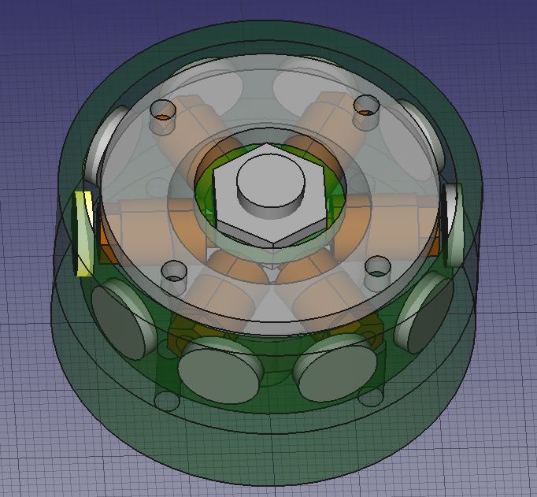

# 3d-printable brushless DC motor

Inspired by [3d-printed DC motor by pitrack]
(http://www.instructables.com/id/3D-Printed-DC-Motor/step4/Mechanical-Design/)

Overall this design is less printable (more vitamins),
but is hopefully practical and powerful enough to be useful in realistic scenarios.

## Notable changes

* Integrated driver electronics. Standard components, designed for reuse.
* Outrunner design instead of inrunner
* Using iron-core (M4 bolts) electromagnets instead of air
* Has a bearing (608) and a metal axel (M8)
* 6 pole stator, 8-10 pole rotor instead of 3/4
* Smaller distance between rotor and stator magnets

Important features retained

* 3d-printable w/common vitamins
* Winding of electromagnets done separately, facilicated by winding tool

Drawbacks

* More vitamins required
* Magnets have to be glued to rotor

## Usecases

* PC/cooling fan. Radial or axial. 80/120 mm.
* Peristaltic pump (fluids). Might need gearing
* Camera jig, using belt/wires to translate to linear motion
* Electromagnet winding tool, so it can help replicate itself!
* Extruder/print cooling fan. Requires minimization

## TODO

* Complete uC and Hall-sensor part of electronics
* Calculate appropriate number of windings
* Manufacture, assemble and test prototype

## Reseach

* [3d-printed transformer](http://3dprint.com/80379/3d-printed-power-transformer), says electromagnets with ProtoPasta Magnetic Iron not working well.

## References

* [Thingiverse: Open Motor](http://www.thingiverse.com/thing:46428)
* [15-deg stepper motor (halfstep capable)](https://www.youtube.com/watch?v=v2FNUNALSTw)

