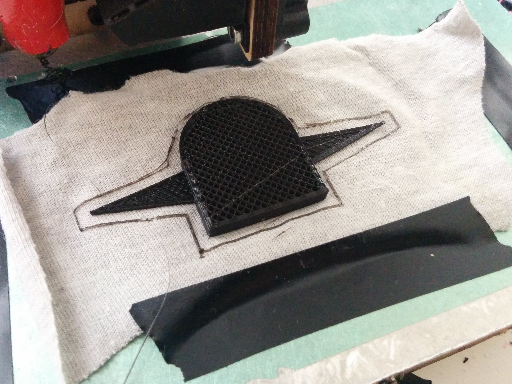

# Configurable flexibility in 3d-printing

Use the geometry to create different material properties in
flexible or semi-flexible materials such as NinjaFlex.

## Voronoi infill for Cura

We've developed a way to let your CAD software specify the infill pattern
of your 3d-printed object. This is done as a special version of CuraEngine,
the slicer in Cura.

Branch: https://github.com/jonnor/CuraEngine/tree/flexible

# Potential Applications

## Printed shoes

Possible production process

* Laser cut or drag-knife textiles for upper sole
* (possibly) Apply bonding agent
* Put textile into FDM 3d-printer, print lower sole using NinjaFlex

Refererence

* http://3dprint.com/83277/3d-printed-footprint-footwear/
* http://www.demilked.com/japanese-inspired-wrap-around-shoes-furoshiki-vibram/

# Tests

## Bonding NinjaFlex to cotton

Printed NinjaFlex directly on cotton that was
stretched out on printbed (fastened with electrical tape).

Manually adjusted the Z-level height by observing first layer.

Print adheres nicely to cotton during printing. No indication this would not work well in large scale.

After removing print, NinjaFlex adheres OK to the cotton. At 1mm thick, it follows the fabric quite easily.
'Peeling' forces between the two will easily cause it to separate however.
 
Using UHU stick glue on the cotton improves adhesion both during print and afterwards,
but does not significantly improve resistance to peeling.

# Ideas

## Thermalbonding NinjaFlex to fibres

If the melting point is ~200 degrees, might be able to fuse the materials together.
This will form a much stronger bond than gluing.

http://www.engr.utk.edu/mse/Textiles/Polyester%20fiber.htm suggests polyester fiber has ~250 deg C melting point.
http://www.swicofil.com/polypropylene.html suggests that polypropylene fibers have ~170 deg C melting points.
https://www.huvis.com/eng/product/prod_info.asp?num=&f=21&s=4&t=50&p=109 suggests that a range of 'low melt woven fibres' exist, with melting points 110-200 deg C.

