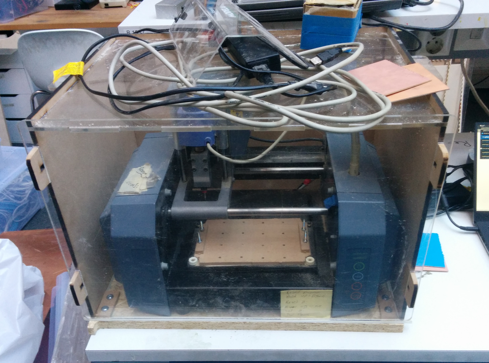

# Parts for Roland Modela

Designed for Roland Modela MDX-15 at [Bitraf](http://bitraf.no) hackerspace.

## Clamping system

Designed to be milled on the Modela itself, from 5-8 mm material, using ~2mm endmill.
The roundclamp is 3d-printed.

The base doubles as a sacrificial layer, and can be planed by the mill to ensure perfect flatness.
Full worksize plates can be fixed with the sideclamps only,
smaller pieces with the roundclamps or combination of side+roundclamp.
You can still use double-sided tape, if that is preferred. 

Vitamins needed:

* 4 M4x30mm hex bolts (for sideclamps)
* 20 M4 nuts (for underside)
* 2 M4x10mm Allen screws

Parts:

* Base 2x
| [DXF](./export/rml-clampbase-half-1.dxf)
| [FreeCAD](./clamping.fcstd)
* Sideclamps
| [DXF](./export/rml-sideclamp-1.dxf)
| [FreeCAD](./clamping-sideclamp.fcstd)
* Roundclamp
| [FreeCAD](./clamping-roundpuck.fcstd)
| [STL](./export/rml-roundclamp-2.stl)

### Planing

Use a 6 mm endmill at 5 mm/sec, 0.5 mm cut depth.
Fill a rectangle of 152 x 100 mm (with origin X=0, Y=0).
Might want to go 2 passes, for total depth of 1 mm.

## Noise isolating box

Inspired by the [boxes at Fablab Lyngen](http://www.dyvikdesign.com/site/research/fablab/the-modela-insulation-boxes-of-fablab-lyngen.html),
redesigned in FreeCAD and using joinery that avoids glues and screws.

[FreeCAD source](box.fcstd) |

Parts

* 6 mm MDF or other woods. Parametric design; can be easily tweaked for 5-10 mm.
* 5 mm acrylic or polycarbonate
* http://www.clasohlson.com/no/b/Jernvare/Beslag-og-opphengning/Tetningslister

TODO

* Redesign front to be in MDF too, with an acrylic door/plate which slides up.
Then don't have to lift the box all the time.

## Course in making PCBs

Theory intro

* Motivation for making PCBs locally
* CNC milling PCB versus etching
* How isolation milling works
* Safety considerations, fibreglass and copperdust
* Where to get materials/tools
* Important design (minimal trace distance, traces width)
* SMD is easier/nicer than holes
* Exporting design (Fritzing/EAGLE/KiCAD)

Demo

* How to prepare exported design. Flipping if export is from underside. Aligning cutouts
* Importing
* Settings
* 
* Traces isolation milling
* Changing tool, setting Z-height
* Board cutout

Practical

* Each participant imports demo design traces
* Puts in the board
* Sets up settings and positions XY, Z
* Runs the job
* MAYBE: let people personalize

Prepare

* TODO: order PCB blanks for Bitmart
[Conrad: FR1 160x100 mm](http://www.conrad.com/ce/en/product/528382/) [100x50 mm](http://www.conrad.com/ce/en/product/528200)
* TODO: design a simple demo circuit. LED on a USB stick?
* TODO: check how long demo milling takes
* TODO: test drilling using 1mm engraver bit
* TODO: mill the bed level
* TODO: get a new Allen key, switch the spindle set-screws
* Document the process on wiki
* Pre-cut a number of boards, 1 per participant
* Make some slides for theory intro

Related

* Electronics: Working with surface mount components

## TODO

* Mount Raspberry PI. Install fabmodules on it
* QR code + link for accessing webinterface
* Consider mounting a tablet
* Vacum attachment / dust-shoe
* Toolbox. For replacement parts, milling bits, double-sided tape, allen keys etc

Fabmodules

* Add code upload/send (from any source)
* Make the sender report progress over Webinterface instead of native TKinter. https://github.com/FabModules/fabmodules-html5/issues/23
Consider checking out the work in [ChiliPeppr](http://chilipeppr.com/), and reusing the server part/interface?
* Make  https://github.com/FabModules/fabmodules-html5/issues/22

## Ideas

Make a streaming gcode-2-RML converter, translating gcode on the fly to the propritary (and badly supported) .RML format.
Can then use all tools which output gcode. Like Vectric VCarve (used for Shopbot), Fusion 360, FreeCAD and various PCB-specific gcode tools.

Auto-leveling would be very desirable, especially for milling PCBs.
[Autoleveling with Shapeoko+GRBL](http://www.shapeoko.com/forum/viewtopic.php?f=28&t=3797).

## Replacement spindle

Motivation

* Motor is very weak, and (semi-expensive) consumable
* Tool fastening is pretty bad. Need to replace entire

Prior art

* https://grabcad.com/library/collet-type-spindle-unit-for-roland-modela-mdx-15-20

Parts

* ER11 C8 spin
* 608 bearings
* 
* Custom machined

TODO

* Figure out efficient way of machining spindle mount/adapter.
Few pieces, few-sided milling job, good registration.
Can we split part down the middle? Then becomes two-part, one-sided milling, no registration.
Challenge is cutting good (half) circles for the bearings to sit in.
In the naive (evenly segmented XY) approach.  A continous half-circle path in XZ will do much better. Can this be done with FreeCAD Path/CAM?
* Design & make spindle mount/adapter.
Preferably attach to the 4 hex screws that originals use.
* Find a replacement motor. Brushless with ESC seems ideal?
Should start on the spindle-on signal from MDX. Is this just 12v?
Ideally can use the same power-supply and connector also.
* Make 

References
------------

Addons

* [Nice dust extraction system](http://wiki.makeitlabs.com/projects/roland-mill-upgrade/upgrades)
* Cyclonic dust separator. [Vid](https://www.youtube.com/watch?v=YsrURCK-H_M)

Replacement parts

* [Spindle motor (MM-40)](https://www.rolanddgastore.com/product.aspx?zpid=1475)
* [Spindle 3mm (PS-3)](https://www.rolanddgastore.com/product.aspx?zpid=1500)
