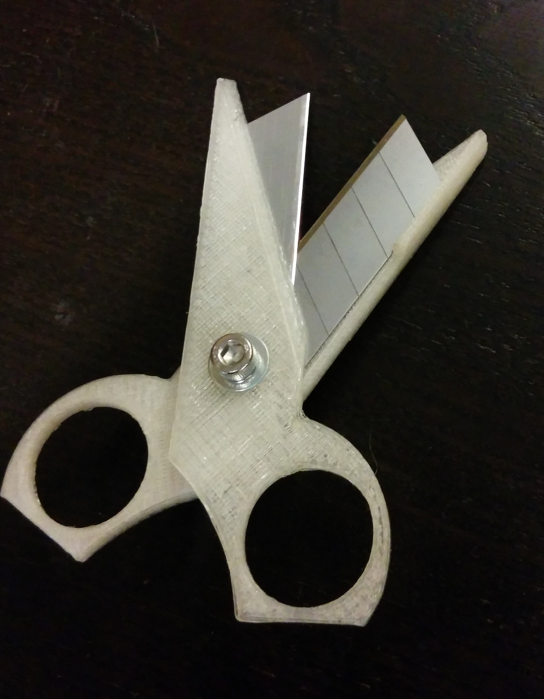
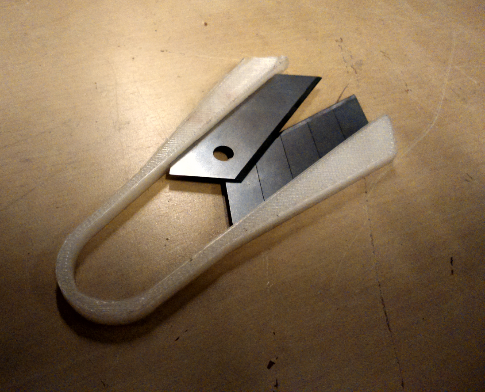
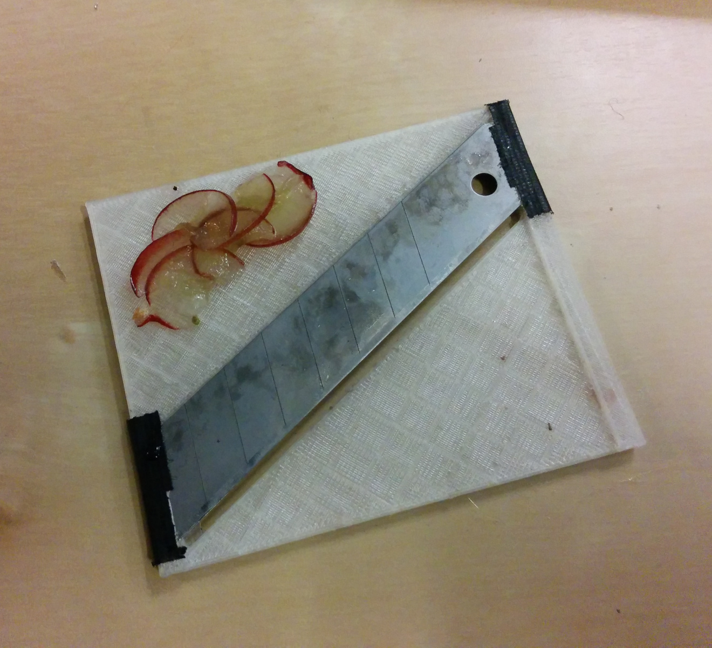
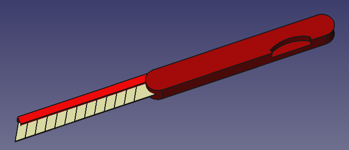
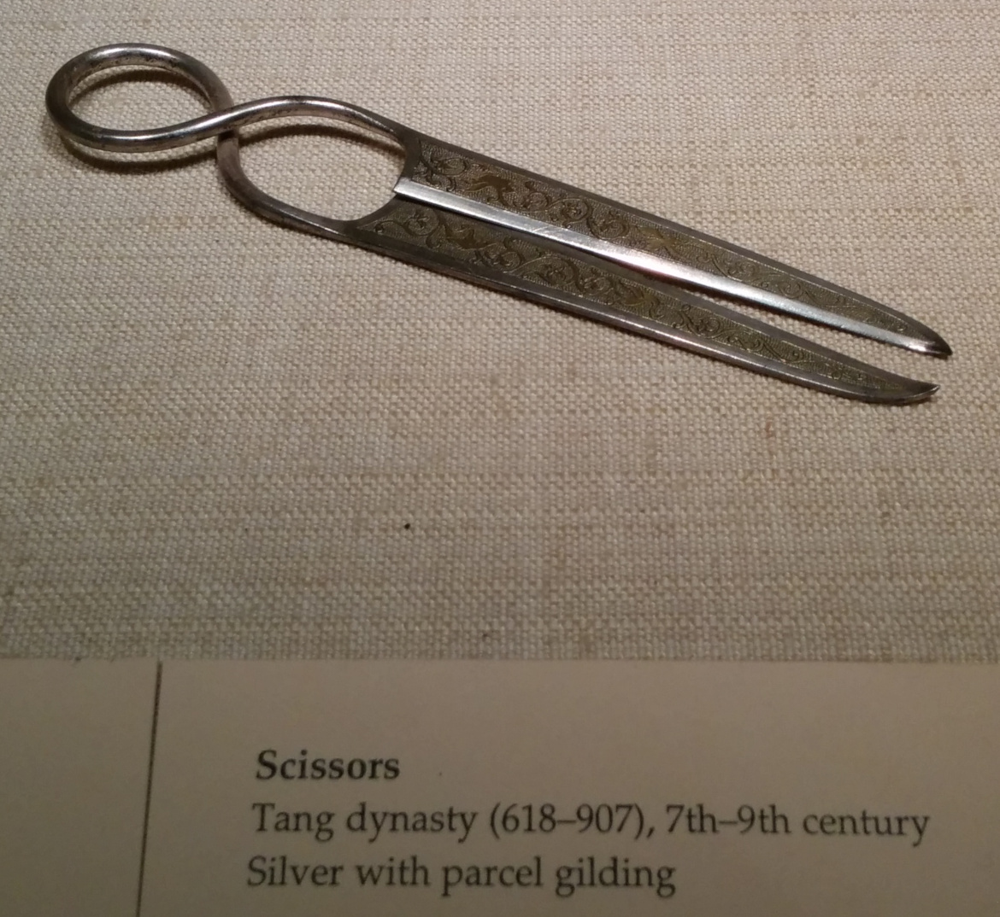
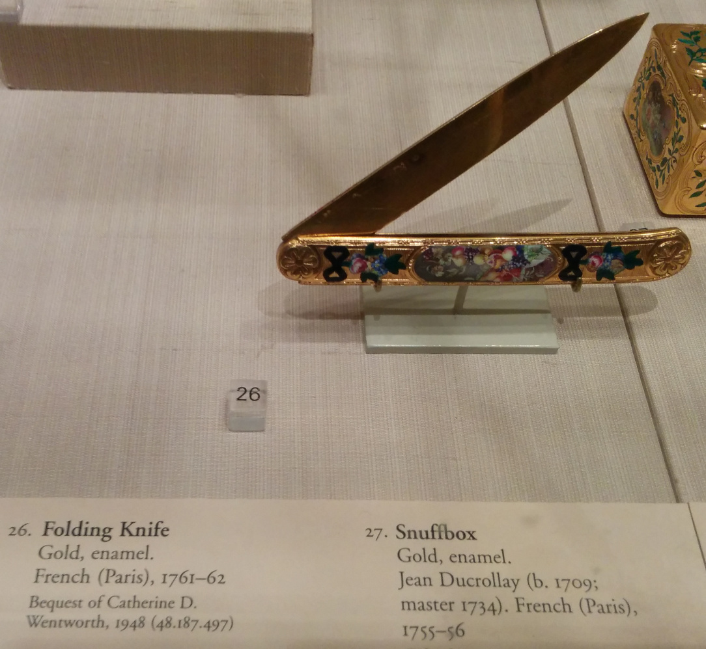

3d-printed tools designed around snap-off, replacable blades.

Status
======

Printed & functional

* Scissors
* Blade shears

In development

* Food slicer
* Folding knife

Planned

* Guiliotine for paper/cardboard
* Mandolin/foodslicer for Julienne cuts
* Compass (circle-maker) for paper/cardboard
* Dragknife for CNC mill
* Hand/finger plane for soft woods
* Plain knife
* Adjustable blade knife (typical for snap-off blades)
* Cheese cutter/slicer. Maybe using non-sharp side or dulled blade

Probably bad/unsafe ideas

* Safety razor
* Potato peeler

Tools
===============
Functional: Printed & tested.

Simple scissors
-----------------
[Thingiverse](http://www.thingiverse.com/thing:638602)|[FreeCAD source](./simple-scissors.fcstd)|[STL](./export/simple-scissors-test-5.stl)

Works OK for medium- and thick paper, as well as cardboard.
Thin paper and other soft/flexible material does not work well when attempting to use shearing motion, but the blades are so sharp that they are easily cut just by slicing though.
Also succesfully tested cutting small electronics wires, small plastic pieces, including 2.85 mm PLA filament.

Vitamins needed:

* 2x 18 mm snap-off blades
* 1x M5 locknut
* 1x M5 bolt 16mm+
* 2x M5 washers

Print 2 pieces of the simple-scissors STL (approx 15-20 mins per piece).
Snap off 3 pieces of each blade before inserting into slot in printed part.

Possible improvements:

* Angle the blades slightly towards eachother
* Devise mechanism to make clamping it down cause blades to tighten towards eachother.

Small blade shears
-------------------

[Thingiverse](http://www.thingiverse.com/thing:640411)|[FreeCAD source](./blade-shears.fcstd)|[STL](./export/blade-shears-4.stl)

Vitamins needed

* 1x 18 mm snap-off blade, split in two

Instructions:

* Print, using 50% infill
* Cut open the support in interior wall using a blade
* Press-fit the blades

Possible improvements:

* Angle the blades slightly torwards eachother
* Oversize the Z-axis of blade socket a little bit to ease mounting
* Add some holes for adding set-screws for fitting blades
* Have a little gap in the support to guide cutting

In progress
===========

Food slicer
----------

Folding knife
----------

Reference
=========

Blades
------

Snap-off blades are flexible, sharp and affordable blades
which are very easy to come by. 

The most common variants are:

* 18 mm height, 10 mm section, 60 deg angle, 100 mm total length. 
* 9 mm height, 5 mm section, 60 deg angle, 80 mm total length.

Thickness is usually 0.4 - 0.5 mm.

Sources

* [Amazon: 50 pack 9 mm, black (20 USD)](http://www.amazon.com/9149-ABB-50B-UltraSharp-Snap-Off-50-Pack/dp/B0006SJAQ6)
* [Amazon: 50 pack 18 mm, black (30 USD)](www.amazon.com/9069-LBB-50B-UltraSharp-Snap-Off-Heavy-Duty/dp/B000LE3V74)
* [Biltema.no: 10 pack 18 mm (20 NOK)](http://biltema.no/no/Verktoy/Handverktoy/Kniv-og-Hovel/Brytebladkniv-191053)
* [Biltema.no: 10 pack 9 mm (20 NOK)](http://biltema.no/no/Verktoy/Handverktoy/Kniv-og-Hovel/Brytebladkniv-9-mm-191054/)

Inspiration
------------

Scissors

Folding knife

Work by others
---------------

* [Thingiverse: EAB (Exchange-A-Blade) Folding Utility Knife](http://www.thingiverse.com/thing:1298487)

Stories
============

When the OpenROV people did a workshop in a rural (but technologically developed) area,
they had brought all the materials and tools needed - apart from scissors.
Sourcing the scissors took several hours and hampered the workshop.

Source: Jakob Nilson, Bitraf

